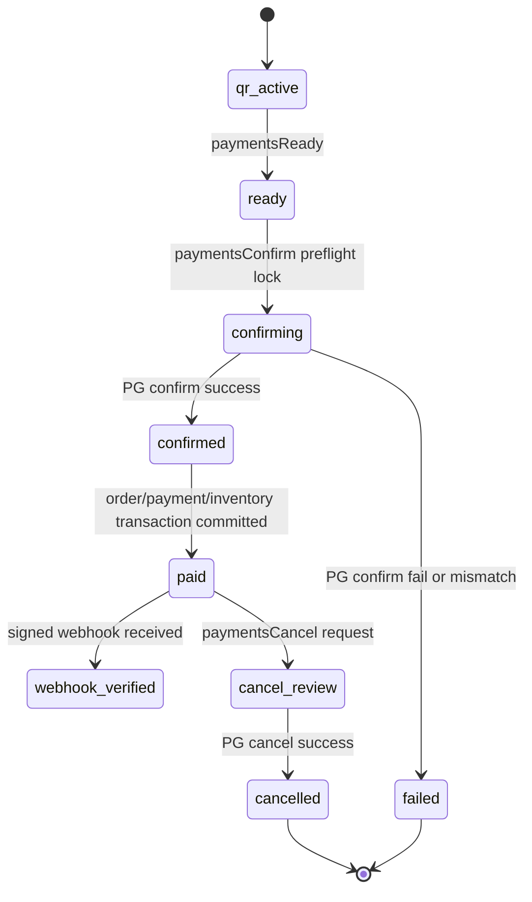

# Firebase PG 결제 서버 설계

## 목표

A5 결제는 브라우저나 Cloudflare Pages가 최종 승인하지 않는다. 고객 휴대폰은 PG 결제창을 호출하고 결과값을 Firebase Functions에 넘기는 역할만 한다. 실제 주문 확정, 금액 검증, PG 승인 confirm, 재고 차감, QR paid 처리, webhook 검증, 취소/환불 장부는 Firebase Functions Admin SDK에서만 처리한다.

## 서버 책임

Firebase Functions가 결제의 단일 서버다.

- `paymentsReady`: QR, 상품, 재고, 기업 MID를 검증하고 서버 금액으로 `payment_intents`를 만든다.
- `paymentsConfirm`: PG 결제창 결과값을 받은 뒤 서버에서 금액과 상품을 다시 검증하고 PG confirm API를 호출한다.
- `paymentsWebhook`: PG webhook 서명을 검증하고 중복 event를 차단한다.
- `paymentsCancel`: 결제 취소/환불 요청을 서버 장부에 남기고 준비된 경우 PG cancel API를 호출한다.
- `paymentsStatus`: 고객/운영 화면이 PG secret 없이 결제 상태만 조회한다.
- `paymentsDiagnostics`: 실결제 오픈 전 빠진 키와 endpoint를 확인한다.
- `adminPgCredentialSave`: 최고관리자가 기업별 MID/시리얼/모듈키/비밀번호/signKey/webhook secret을 저장한다.
- `adminPgConnectionTest`: 기업별 결제 준비 조건을 서버에서 점검한다.
- `adminPgActivation`: 조건이 맞는 기업 MID만 운영 활성화한다.

## 결제 상태머신



## 실결제 가능 조건

실결제는 아래 조건이 모두 맞을 때만 열린다.

- `PG_PROVIDER`가 `mock`이 아니다.
- Firebase Functions에 `PG_SECRET_KEY`, `PG_WEBHOOK_SECRET`, `PAYMENT_WEBHOOK_URL`, confirm endpoint가 있다.
- 기업별 `company_pg_credentials/{companyId}`에 MID, 시리얼번호, 모듈키가 있다.
- 기업별 비밀번호/signKey/webhook secret은 Secret Manager 참조값 또는 AES-GCM 암호화 payload로 저장되어 있다.
- 기업 PG 상태가 `active`다.
- 장바구니는 하나의 기업/MID 상품만 포함한다.
- 서버가 Firestore 상품 가격으로 금액을 다시 계산했고 고객 브라우저 금액과 일치한다.
- QR 세션이 active이고 만료되지 않았다.
- 상품이 active/approved이고 재고가 충분하다.

## 키 저장 원칙

공개값만 브라우저로 나간다.

- 브라우저 허용: `NEXT_PUBLIC_PG_PROVIDER`, `NEXT_PUBLIC_PG_CLIENT_KEY`, `NEXT_PUBLIC_PG_SCRIPT_URL`, `NEXT_PUBLIC_PG_REQUEST_FUNCTION`
- 서버 전용: `PG_SECRET_KEY`, `PG_WEBHOOK_SECRET`, `PG_CREDENTIAL_ENCRYPTION_KEY`
- 기업별 민감값: `company_pg_credentials`에 참조명 또는 `credentialCrypto.ts` AES-256-GCM 암호화 payload로 저장

원문 secret, 비밀번호, signKey는 Firestore 일반 필드나 기업관리자 화면에 저장하지 않는다. 최고관리자 감사 로그에도 암호문 본문은 `[encrypted]`로 마스킹한다.

## Firestore 서버 소유 장부

아래 컬렉션은 클라이언트 직접 쓰기가 금지된다.

- `payment_intents`
- `payments`
- `orders`
- `order_items`
- `payment_events`
- `webhook_events`
- `cancel_requests`
- `inventory_movements`
- `inventory_reservations`
- `audit_logs`
- `payment_audit_logs`

Functions Admin SDK만 쓴다. 화면은 권한과 토큰 조건으로 필요한 최소 정보만 읽는다.

## 고객 결제 흐름

1. 태블릿 장바구니에서 QR을 만든다.
2. 고객 휴대폰에서 QR 페이지를 연다.
3. 고객 정보와 수령 방식을 입력한다.
4. 고객 브라우저가 PG 공개 SDK 결제창을 연다.
5. PG 결제창 결과의 `paymentKey`, `transactionId`, `tid` 계열 값을 받는다.
6. 고객 브라우저가 `paymentsConfirm`에 결과값을 전달한다.
7. Firebase Functions가 서버 금액, QR, 상품, 재고, 기업 MID를 다시 검증한다.
8. Firebase Functions가 인피니 confirm endpoint를 호출한다.
9. 승인 성공 시 주문/결제/재고/QR을 하나의 서버 트랜잭션으로 확정한다.
10. 고객은 주문조회 페이지에서 주문 완료 상태만 확인한다.

## 인피니 공식 문서 수령 후 교체 지점

현재 `providerAdapter.ts`는 인피니 confirm/cancel endpoint와 헤더/본문을 받을 수 있는 슬롯을 갖고 있다. 인피니 공식 문서를 받으면 아래만 정확한 스펙으로 맞추면 된다.

- confirm URL, cancel URL, status URL
- Authorization 방식
- MID, serial, moduleKey, merchantPassword, signKey 위치
- 금액 검증 hash/signature 생성 방식
- 결제창 결과 필드명
- 승인 응답의 TID/paymentKey/receiptUrl 필드명
- webhook signature header와 HMAC 알고리즘

이 교체는 Firebase Functions `providerAdapter.ts` 내부에서만 한다. 고객 화면이나 기업관리자 화면에 PG secret 로직을 넣지 않는다.

## 배포 체크

배포 전 필수 확인:

```txt
firebase functions:secrets:set PG_SECRET_KEY
firebase functions:secrets:set PG_WEBHOOK_SECRET
firebase functions:secrets:set PG_CREDENTIAL_ENCRYPTION_KEY
firebase deploy --only functions,firestore:rules
npm run check:env
```

진단 endpoint:

```txt
GET /paymentsDiagnostics
```

여기서 `realPgCanBeCalled=true`, `credentialVaultReady=true`, 기업별 `paymentReady=true`가 확인되어야 운영 PG 결제를 열 수 있다.
